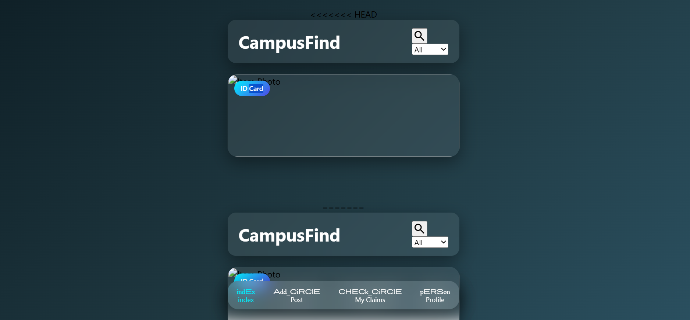
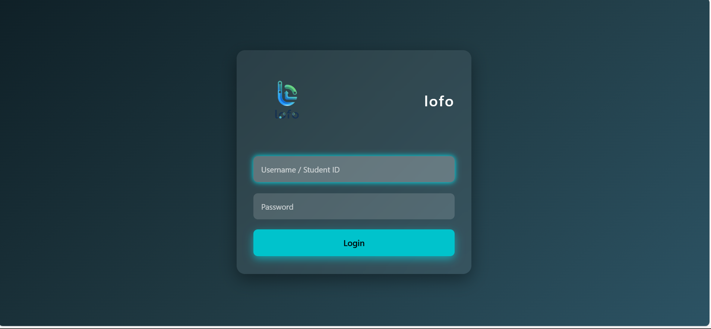
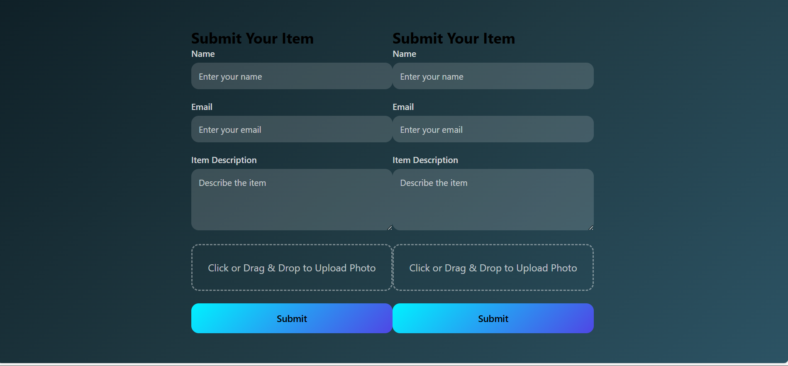

<p align="center">
  
</p>

# [ lofo] 🎯

## Basic Details

### Team Name: [bloomtwins]

### Team Members
- Member 1: [asna p] - [emea arts and science of college]
- Member 2: [fathima shahna a] - [emea arts and science of college]

### Hosted Project Link
[https://asnasharaf.github.io/tink-her-hack-temp/]

### Project Description
[to find lost things through website very easily]

### The Problem statement
[to find lost things]

### The Solution
[we can identify lost things easily through this website]

---

## Technical Details

### Technologies/Components Used

**For Software:**
- Languages used: [e.g., html, css, Java]
- Frameworks used: [e.g., React, Django, Spring Boot]
- Libraries used: [e.g., axios, pandas, JUnit]
- Tools used: [e.g., VS Code, Git, Docker]

**For Hardware:**
- Main components: [List main components]
- Specifications: [Technical specifications]
- Tools required: [List tools needed]

---

## Features

List the key features of your project:
- Feature 1: [easily login college students]
- Feature 2: [we can upload the  descripition about lost product]
- Feature 3: []
- Feature 4: [Description]

---

## Implementation

### For Software:

#### Installation
```bash
[Installation commands - e.g., npm install, pip install -r requirements.txt]
```

#### Run
```bash
[Run commands - e.g., npm start, python app.py]
```

### For Hardware:

#### Components Required
[List all components needed with specifications]

#### Circuit Setup
[Explain how to set up the circuit]

---

## Project Documentation

### For Software:

#### Screenshots (Add at least 3)


*Add caption explaining what this shows*


*Add caption explaining what this shows*


*Add caption explaining what this shows*


---

